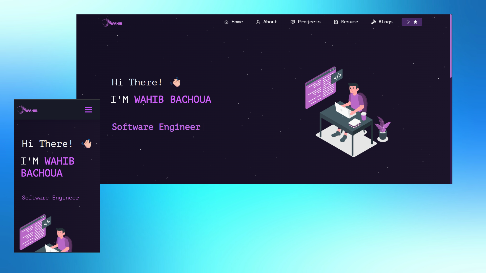

<h2 align="center">
  Portfolio Website <br/>
  <a href="https://wahib-bachoua.github.io" target="_blank">wahib bachoua</a>
</h2>
<div align="center">
  
</div>

<br/>

<center>

[](https://forthebadge.com) &nbsp;
[](https://forthebadge.com) &nbsp;
[](https://forthebadge.com) &nbsp;

</center>

## Built With

My personal <a href="https://wahib-bachoua.github.io" target="_blank">portfolio </a> which features some of my github projects as well as my resume and technical skills.<br/>

This project was built using these technologies.

- React.js
- Node.js
- Express.js
- CSS3

## Features

**📖 Multi-Page Layout**

**🎨 Styled with React-Bootstrap and Css with easy to customize colors**

**📱 Fully Responsive**

## Getting Started

Clone down this repository. You will need `node.js`, `pnpm` and `git` installed globally on your machine.

### Prerequisites

Install pnpm globally if you haven't already:

```bash
npm install -g pnpm
```

## 🛠 Installation and Setup Instructions

1. Installation: `pnpm install`

2. Fix react-parallax-tilt compatibility:

   ```bash
   pnpm install react-parallax-tilt@1.7.42 --save-exact
   ```

3. In the project directory, you can run: `pnpm start`

Runs the app in the development mode.\
Open [http://localhost:3000](http://localhost:3000) to view it in the browser.
The page will reload if you make edits.

### Other Commands

- `pnpm build` - Creates a production build
- `pnpm test` - Runs tests
- `pnpm deploy` - Deploys to GitHub Pages

## Usage Instructions

Open the project folder and Navigate to `/src/components/`. <br/>
You will find all the components used and you can edit your information accordingly.

### Show your support

Give a ⭐ if you like this work!
